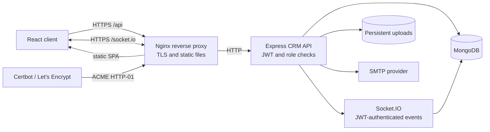

## Runtime boundaries

- Nginx is the only public application service. It serves the React single-page app, forwards `/api` to Express, and forwards `/socket.io` with WebSocket upgrades.
- Express owns authentication, role/team authorization, CRM workflows, and persistence. MongoDB is not published to the host network.
- Socket.IO authenticates the same JWT as the API. Server code assigns each connection to its user room; event notifications are sent only to that room.
- MongoDB data, API uploads, WhatsApp browser credentials, and TLS certificates are separate persistent Docker volumes.
- SMTP is optional and used for email delivery. In-app notifications remain stored in MongoDB and are also pushed over Socket.IO.
